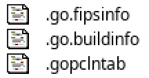
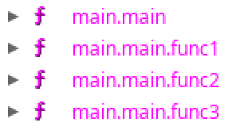
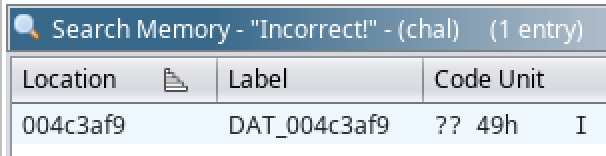
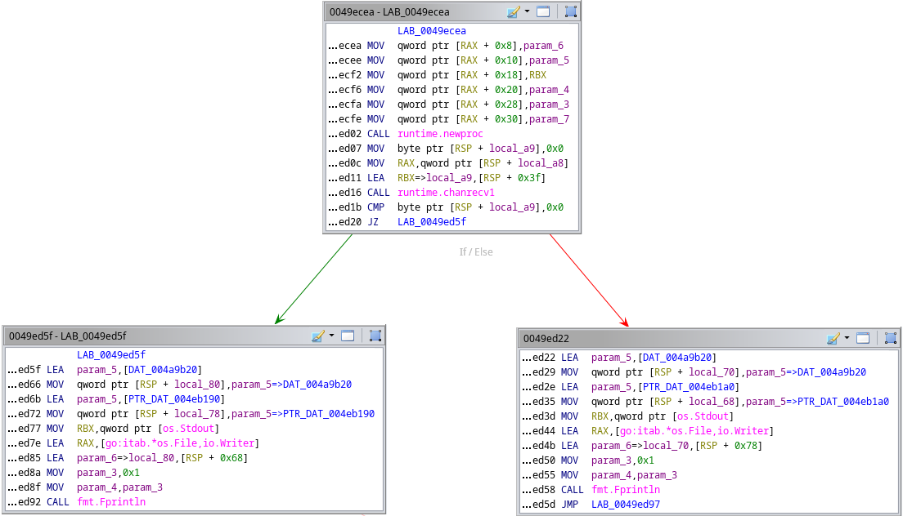

All we're given for this challenge is a binary and the flavour text "any way the
wind blows". First thing is to run `file` on it to see what we're dealing with:

```
$ file chal
chal: ELF 64-bit LSB executable, x86-64, version 1 (SYSV), statically linked, BuildID[sha1]=7de5f90a78ca370302feb17648ca6ee1b90248f0, with debug_info, not stripped
```

Not stripped helps. Now to run it to get an idea of what the program is doing
and what our goal might be:

```
$ ./chal
> hello
Incorrect!
```

Looks like a password check, and presumably our goal is to find the password.

Time to start properly reversing it by loading it into Ghidra, which takes us to
`main.main` instead of just a regular main function. That alongside some Go
specific ELF sections tells us that this is a Go binary:



Since we have symbols we can easily see the non-library functions listed:



So we have the main function and 3 helper functions without particularly
informative names. From running the program we know that it prints "Incorrect!"
if you enter an invalid password, so we can start by finding how it decides to
print that. A Go string looks something like this:

```c
struct gostr {
	char *str;
	int len;
};
```

All the actual string contents are stored concatenated together in a huge blob,
which the Go string structures store pointers into along with the string length.
This means that doing a normal string search in Ghidra will just give us the
huge blob and not the specific bit we're looking for, so instead we can use the
memory search to look for the specific sequence of bytes:



We can then work backwards using the references to this address to see where
it's used. We end up in a `fmt.Fprintln` call in this small decision tree inside
`main.main`:



It turns out `runtime.chanrecv` (1 and 2) is part of Go's channel system, which
is essentially a queue of data you can write to and read from. They are often
used to pass data between goroutines (basically threads). We can infer that
`rax` is a pointer to the channel structure and `rbx` is a pointer to the
address to write the data received from the channel to. By following the pointer
chain back down for the string printed on the other side of the comparison, we
can see that if the data received on the channel is 0 the program prints
"Incorrect!" and otherwise prints "Correct!". This means we need to figure out
where the data on the channel comes from.

Looking more broadly at `main`, we can see that it creates 5 channels with
`runtime.makechan`, before reading our input and ensuring that it is 24
characters long. It then starts `func1`, `func2` and `func3` as goroutines with
`runtime.newproc` passing in different combinations of the channels for each.

The channel used for the final determination is only passed to `func3`, so I
looked there first. It passes data in and out of channels a lot, does some
XOR operations with it, and bails early if it doesn't get the data it expects.
The other functions send and receive data as well, and `func2` does some XOR
operations of its own.

Honestly, I didn't feel like untangling this, so I had a better idea. Since
`func3` bails out early with a bad input, and the binary is running locally, we
can turn the amount of our input that gets processed into a makeshift side
channel for how much of our input is correct, allowing us to brute force
character by character.

To do this we can use `gdb`, taking advantage of its ability to count the number
of times a breakpoint is hit. By setting a breakpoint around where the next
character of our input is processed we can figure out how many characters of our
input have been accepted, based on how many times this happens.

This was my script for `gdb`:

```
break *0x49efef
commands
continue
end
run
info breakpoints
quit
```

This sets a breakpoint at the beginning of the input processing loop, at which
we instantly continue. After the program has finished running we print
the status of the breakpoint including how many times it was hit. As a command
(with some dummy input) we see this at the end:

```
$ echo test | gdb -n -q -x gdbscript chal
[snip]
Num     Type           Disp Enb Address            What
1       breakpoint     keep y   0x000000000049efef in main.main.func3 at chal.go:62
        continue
```

The breakpoint wasn't hit once, since our input was the wrong length and the
program exited before even starting the verification. Let's try again with a
24-character password:

```
$ echo AAAAAAAAAAAAAAAAAAAAAAAA | gdb -n -q -x gdbscript chal
[snip]
Num     Type           Disp Enb Address            What
1       breakpoint     keep y   0x000000000049efef in main.main.func3 at chal.go:62
        breakpoint already hit 1 time
        continue
```

You see that "breakpoint already hit"? That tells us how many times we've hit
the start of the loop, and in this case it processed the first character of our
input and it was wrong, so it stopped. Now we can script this to brute force the
entire input:

```py
import string
import subprocess

known = ""

while len(known) < 23:
	for char in string.printable:
		# for some reason the breakpoint can rarely hit less
		# or more than the expected amount, so we do it 3 times
		# and take the most common result
		results = {}

		for i in range(3):
			attempt = known + char + (24 - len(known) - 1)*"A"
			result = subprocess.run(["gdb", "-n", "-q", "-x", "gdbscript", "chal"], text=True, capture_output=True, input=attempt)
			index = result.stdout.find("breakpoint already hit")

			if index == -1:
				continue

			# extract count
			result = result.stdout[index + len("breakpoint already hit "):]
			result = result[:result.index(" ")]
			count = int(result)

			if count in results:
				results[count] += 1
			else:
				results[count] = 1

		# check the highest frequency result
		if sorted(results.items(), key=lambda x: x[1], reverse=True)[0][0] > len(known) + 1:
			known += char
			print(known)
			break

# the final character would be processed whether or not
# it is correct, but we know it anyway due to the flag format
print(known + "}")
```

This slowly outputs the flag one character at a time, kind of like something
you'd see in a hacker movie :)

```
.
.;
.;,
.;,;
.;,;.
.;,;.{
.;,;.{g
.;,;.{go
.;,;.{goh
.;,;.{goh3
.;,;.{goh3m
.;,;.{goh3m1
.;,;.{goh3m1a
.;,;.{goh3m1an
.;,;.{goh3m1an_
.;,;.{goh3m1an_r
.;,;.{goh3m1an_rh
.;,;.{goh3m1an_rh4
.;,;.{goh3m1an_rh4p
.;,;.{goh3m1an_rh4p5
.;,;.{goh3m1an_rh4p50
.;,;.{goh3m1an_rh4p50d
.;,;.{goh3m1an_rh4p50dy
.;,;.{goh3m1an_rh4p50dy}
```
And there's the flag: `.;,;.{goh3m1an_rh4p50dy}`

When I say slowly, I do mean slowly, running `gdb` over and over is a horrible
way to do this. It takes just over 5 minutes on my machine. It would probably be
pretty fast if you kept `gdb` running and just deleted and remade the breakpoint
each time, but I didn't feel like scripting interactions with a running program,
this was meant to be the lazy solution after all.

Hope you found my approach interesting! It's not a pretty solution, but it is a
working one.
